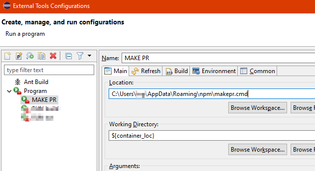

# makepr

Quickly open url for PR or something else using url template in package.json

Requires a workign `git` command in shell

This tool will lookup current branch using git command `git branch --show-current` and generate and open the url.

# Usage

install the tool

```
npm i -g makepr
```

Configure your pacakge.json. Add a `makepr` section that defines url to call based on current branch

```json
"makepr":{
  "url":"https://your-git-server.com/something/{BRANCH_NAME}"
}
```

Run the command anywhere inside your project
```
makepr
```

# Setup in eclipse

Find path to the command after isntalling

- win: `where makepr` in cmd (%homepath%\AppData\Roaming\npm\makepr.cmd)
- mac: `which makepr` in shell
- linux: `whereis makepr` in shell (/usr/bin/makepr)

set the location in eclipse and set working directory to variable `${container_loc}`




